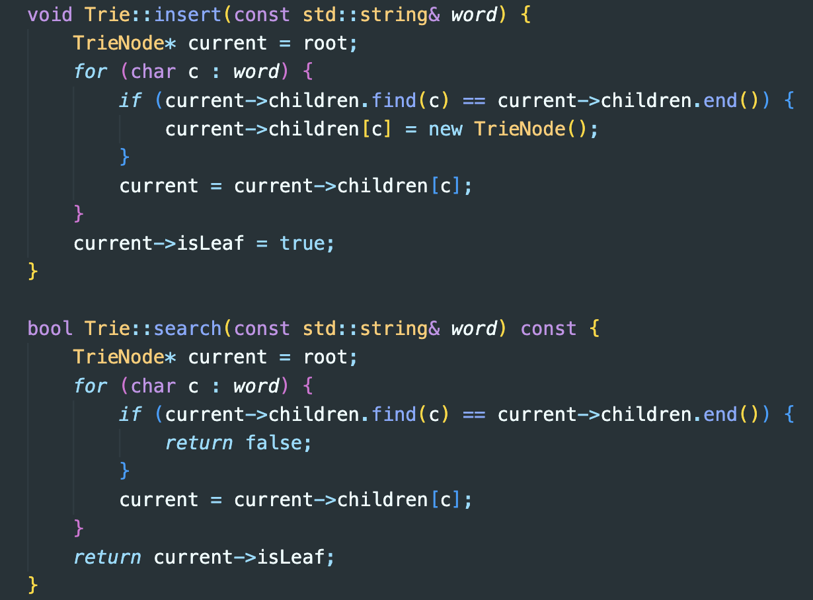
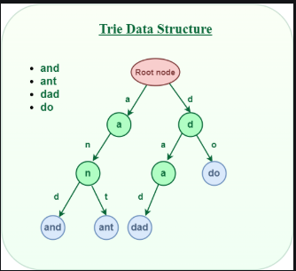

#### Rex Sheikh 
#### Data Structures Final Project 

# Overview 
This project features the Trie data structure which can efficiently store and retrieve words in large search spaces like dictionaries making it a suitable choice for tools like autocomplete and spellchecking. Here, it is used to quickly check user input against predetermined words in a 2D typing game. Users must quickly and accurately type the presented words to stymie an invading alien armada before they land. 
# Getting Started 
## SFML
This project uses the Simple Fast Media Library (SFML) for rendering the 2D game space. Visit https://www.sfml-dev.org/ for downloads and tutorials. Anything with the namespace "sf::" belongs to SFML. The top left corner of the window is the origin, point (0,0) with x and y coordinates representing pixels within the window. There are no negative values and the syntax "number.f" is used frequently to represent float values. Floats are encouraged because they provide smoother animations in VideoMode. Here is a brief overview of some key SFML methods and how they are used: 
- RenderWindow(sf::VideoMode(x,y),const std::string&) : establishes a named window of a specified size. The game initializer sets the size to 800x800 pixels with name "Space Invaders."
    - window.isOpen(): method to check whether the window is still open used in the main game loop. Simply put, the game runs while the window is still open. 
    - window.pollEvent(sf::Event&): detects events, in this case key strokes and window closure. 
    - window.clear(sf::Color): clears the window and takes an optional input to set the color. 
    - window.draw(const sf::Drawing): Places an object in the window. Used for text, invaders, and end game screen presentation. 
    - window.display(): prints the rendered frame onto the screen. 
    - window.close(): closes the window. 
- sf::Event: captures user keystrokes and window actions, namely window closure. 
    - sf::Event::type: identifies event type, which in this context include:
        - Closed, TextEntered, and KeyPressed
- sf::Clock: tracks elapsed time for core game logic. Seen in spawning new invaders and calculating the words per minute in the endgame screen. 
    - clock.getElapsedTime() - returns the elapsed time from clock start to current time. 
    - clock.restart() - restarts the clock. 
- sf::Time - represents time duration. 
    - the method time.asSecconds() is useful for float representation and follow-on processing. 
- sf::Text: creates a text object to be rendered in the 2D gamespace 
    - text.setFont(const sf::Font&): sets font text
    - text.setString(const std::string&) - sets displayed text to the input string. 
    - setFillColor(const sf::Color&): sets text color 
    - setPosition(float,float): sets the x,y coordinate for the text. 
    - getLocalBounds() - every object in sfml has a bounding rectangle. This method returns the bounding rectangle. This used in positioning text objects more easily. 
- sf::ConvexShape: renders custom polygons, in this case triangles for the invaders. 
    - shape.setPointCount: sets the number of points in the shape, three for the triangles in the Invader class. 
    - shape.setPoint(unsigned int,sf::Vector2f): defines the position of a vertex. 
    - shape.setFillColor(const sf::Color&): uses one of SFML's colors to create fill color within shape bounds. 
    - shape.move(const sf::Vector2f&): moves the shape by a specified offset. 
    - shape.getPosition(): returns the current position of the shape. 
- sf::Rectangle Shape: used to contain text and prompts. 
- sf::Sprite: used to represent 2D images in the game window. Here, that means the invaders. 
    - sprite.setPosition(float,float): places a sprite in the provided (x,y) coordinate. 
- sf::Texture: loads texture into a sprite. The background image in the assets folder uses this method along with scale to fill the whole game window. 
- sf::Vector2f(x,y): represents 2D vectors for positions, sizes and offsets. Used extensively for invader/text placement and movement calcualtions. 
## Classes 
There are three classes in this project, each providing encapsulation of core logic and processing necessary for game flow. 
### Trie/TrieNode Classes
The first data structure and centerpiece of this project is the Trie/TrieNode class which is used to efficiently store and search words loaded from "words.txt." The Trie has a single member: 
* TrieNode* root: used to traverse the nodes in the data structure. 

The Trie itself is comprised of TrieNodes which have two members:
* bool isLeaf: True/False whether a character is the last in the string. 
* unordered_map<char,TrieNode*>children: a character's children nodes used for traversal. 

Building and traversing the Trie is done accomplished with the below methods. 

  

* The insert method uses the root node to visit each character. Each TrieNode has an unordered map with the characters as keys. If the current character is not in the map, then current->children.find(c) == current->children.end() is true and the if statement executes to create a new TrieNode. The current cursor is set to this new character. When the for loop completes, current is the final character in the word and it's leaf boolean is set to true, marking the end of the word. This method establishes the parent/child relationship between TrieNodes that is crucial for checking the string sequentially.

  

* The search method traverses the Trie, again using the root as the staring point for a cursor. The input string is checked against the data structure by evaluating whether each character is present within the children member. If a character in the string is not found then the input is not a valid string. Otherwise, the for loop completes and a final check is done with the boolean isLeaf. If the last character is indeed a leaf node and all characters have been checked and passed in order thus far, the last piece to evaluate is whether or not this is indeed a complete word. A complete, correctly spelled word will return true and false otherwise. Searching for a word of length *L* has time complexity *O(L)* which is comparitively fast considering a simple search and verify method like maintaining a list of known words. 

## Game Class
The game class manages the overall game logic to include the main game loop, user input events, rendering and game state. Inspecting the members and methods of this class reveals its utility: 
- initialize(): This method begins by resetting game state variables so the user can play again if they choose. It then loads the words from a text file to build the initial five invaders. 
- handleEvents(): responds to window closure and captures user textInput. A key piece of logic connects the words stored in the invaders and the user's input in this method. Once a user has completed a word and pressed the 'Enter' key, that input is checked against the invaders stored words. If there is a match, that invader's motion is terminated and a hit counter is incremented. 
- update(): updates the game state by marking hit invaders, spawining new invaders every three seconds, and determining win/loss state. A player wins if they clear all of the words and lose if an invader reaches the ground. The member 'numHit' checks the number of correctly inputted words against those loaded from the text file to set the gameOver boolean. Each invader's position is inspected to see if their position is the bottom of the window, meaning they landed and the player loses. 
- render(): draws all game elements to to include the background, invaders, and the text below the invaders. 

## Invader Class 
The Invader class draws a simple triangle with text beneath to show the player the words they must type to win. This class is relatively straightforward with each invader given an initial (x,y) position. It's motion is randomly set to move straight down, downward in wavelike pattern, or downward in diagonal steps.  

# Space Invaders Gameplay

# Conclusion

# Notes 
1 - Compiling with: g++ -o typing_test main.cpp -std=c++11 -I/opt/homebrew/include -L/opt/homebrew/lib -lsfml-graphics -lsfml-window -lsfml-system

2 - how to draw a triangle in SFML
Point 0: The bottom-middle point of the triangle.
Set to (size.x / 2.f, size.y) to position it at the middle of the bottom edge.
Point 1: The top-left corner.
Set to (0.f, 0.f) to position it at the top-left of the bounding box.
Point 2: The top-right corner.
Set to (size.x, 0.f) to position it at the top-right of the bounding box.

# references 
1. starry night background https://www.pexels.com/search/starry%20night/
2. general SFML setup and usage https://www.sfml-dev.org/tutorials/2.6/
3. enumeration: https://en.cppreference.com/w/cpp/language/enum
4. emplace_back vs push_back (needed to create invaders inside a loop)
    - https://cplusplus.com/reference/vector/vector/emplace_back/
    - https://cplusplus.com/reference/vector/vector/push_back/
    - https://andreasfertig.blog/2023/04/push_back-vs-emplace_back-when-to-use-what/
5.  google fonts - https://fonts.google.com/
6. loading an sfml texture for a background: https://stackoverflow.com/questions/24358968/loading-a-texture-in-sfml
7. how to scale a background image to fit the window: https://stackoverflow.com/questions/36448101/2-3-1-set-scale-of-background-texture-to-renderwindow-size
8. static casting - C++ Primer 5th Ed., pg 163. 
9. fstream basics/loading words from text file: https://cplusplus.com/reference/fstream/fstream/?kw=fstream+
10. SFML keyboard input - https://www.youtube.com/watch?v=k1jIxFWT6yI 
11. SFML Shape drawing tutorial: https://www.sfml-dev.org/tutorials/2.0/graphics-shape.php
12. Random library - https://cplusplus.com/reference/random/?kw=random
13. enum class for setting motion types within a switch statement: https://forums.unrealengine.com/t/how-do-i-use-an-enum-with-a-switch-statement/430262/3
14. Trie (general) - https://en.wikipedia.org/wiki/Trie
15. Trie (implementation) - https://www.geeksforgeeks.org/trie-insert-and-search/
16. C++ Unordered map - https://en.cppreference.com/w/cpp/container/unordered_map